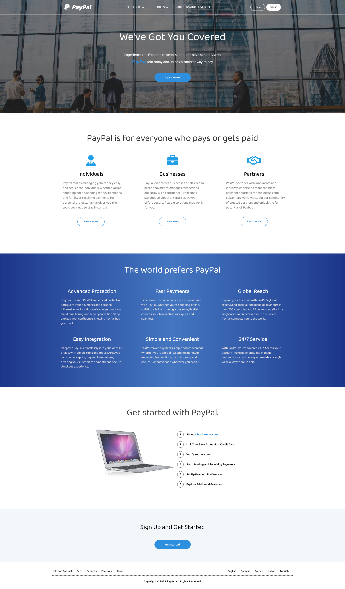
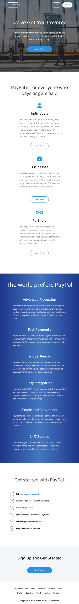

This project is a custom PayPal UI design created using **HTML**, **CSS**, and **JavaScript**. It is a visually appealing and responsive front-end implementation that mimics a payment gateway interface.

## Live Preview

Check out the live demo of the project: [PayPal UI Design Live Preview](https://tranquil-banoffee-f6c8b8.netlify.app)

## Features

- **Responsive Design**: Optimized for various screen sizes.
- **Interactive Elements**: Functional buttons, form validations, and animations.
- **Clean and Modern Layout**: Adheres to PayPal's design language principles.
- **Custom Styles**: Built with vanilla CSS for better customization.

## Technologies Used

- **HTML**: Markup for the structure of the design.
- **CSS**: Styling, layout, and responsive adjustments.
- **JavaScript**: Interactivity and DOM manipulation.

## Preview

